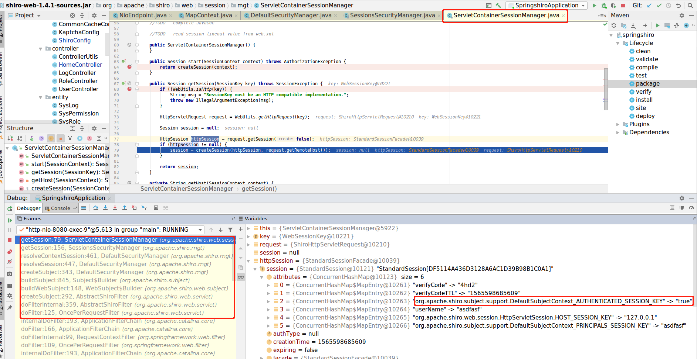
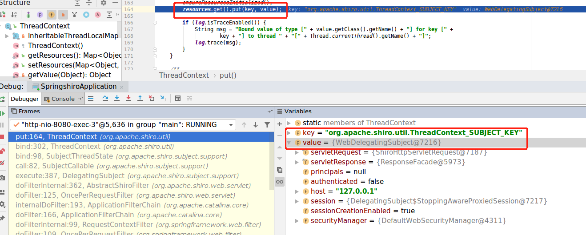
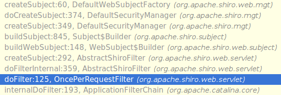
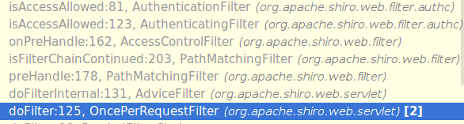
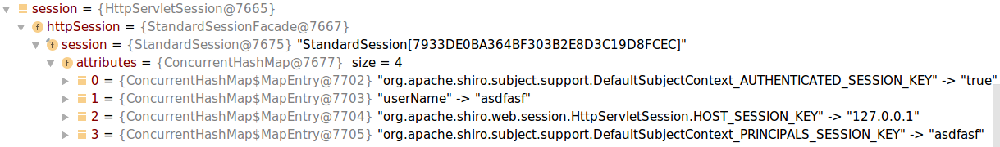
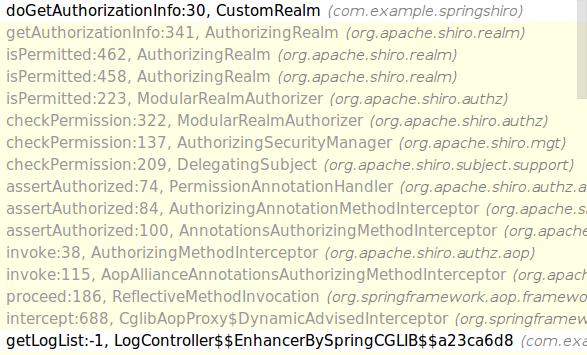
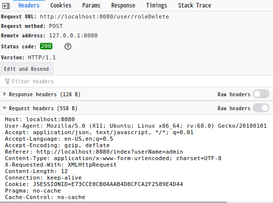

# SpringLearning

　　记录Spring框架下如何架构微服务。比如：MVC,Configuration Server,circuit breaks, intelligent routing,micro-proxy,control bus, ont-time tokens,leadership election, distributed sessions, cluster state等

　　并总结一些开发中的心得体会，比如：打log的想法；异常处理想法;IDEA社区版使用心得等。


# [SpringMVC](SpringMVC/README.md)

　　如何快速搭建SpringBoot MVC；一些常见的用法总结；


# IDEA的方便性

　　本章主要讲在使用IDEA的时候，一些开箱即用的功能让我个人觉得眼前一亮．我没有使用商业版本，而是使用社区版本。比如：写法的一些智能提示，把更好的写法以建议的形式标出来;自带了CodeStyle检测，也可以自行加Eclipse的CodeStyle插件;调用方法时候显示表示你的参数是输给调用方法的哪一个参数;直接集成了版本控制（查看分支，比对等功能都直接开箱可用）;命令行（这样不必再开命令行做git相关操作，如果你个人喜欢通过命令行操作的话）;

　　从上可以看出IDEA把项目的所有开发周期所用到的工具都集中到了该开发环境中，所以不必来回转换；而智能提示给出的一些建议都是普适的，所以很通用。让大家写代码的时候也很容易边写边获取前人的各种经验。

下图展示了，git操作页（提交树、比较等）、终端操作页、调用参数提示、maven操作区等


## IDEA中MavenJava

在使用IntelliJ IDEA中Maven编译过程中可能会报diamond operator is not supported in -source 1.5之类的错误，出现这样的原因是Maven插件的默认配置有问题。可以下pom.xml中加入如下配置解决

```
  <properties>
    <java.version>1.8</java.version>
    <maven.compiler.source>${java.version}</maven.compiler.source>
    <maven.compiler.target>${java.version}</maven.compiler.target>
  </properties>
```

然后按"Ctrl+Shift+Alt+S"打开项目配置，设置Modules的Language Level为"8"：


最后按"Ctrl+Alt+S"打开设置，搜索"Java Compiler"，将默认jdk和当前modual的jdk版本切换为1.8即可：


# SpringShiro session获取方式

获取Session的方法定义在SessionManager接口中细节见如下代码

```java
public interface SessionManager {

    /**
     * Starts a new session based on the specified contextual initialization data, which can be used by the underlying
     * implementation to determine how exactly to create the internal Session instance.
     * <p/>
     * This method is mainly used in framework development, as the implementation will often relay the argument
     * to an underlying {@link SessionFactory} which could use the context to construct the internal Session
     * instance in a specific manner.  This allows pluggable {@link org.apache.shiro.session.Session Session} creation
     * logic by simply injecting a {@code SessionFactory} into the {@code SessionManager} instance.
     *
     * @param context the contextual initialization data that can be used by the implementation or underlying
     *                {@link SessionFactory} when instantiating the internal {@code Session} instance.
     * @return the newly created session.
     * @see SessionFactory#createSession(SessionContext)
     * @since 1.0
     */
    Session start(SessionContext context);

    /**
     * Retrieves the session corresponding to the specified contextual data (such as a session ID if applicable), or
     * {@code null} if no Session could be found.  If a session is found but invalid (stopped or expired), a
     * {@link SessionException} will be thrown.
     *
     * @param key the Session key to use to look-up the Session
     * @return the {@code Session} instance corresponding to the given lookup key or {@code null} if no session
     *         could be acquired.
     * @throws SessionException if a session was found but it was invalid (stopped/expired).
     * @since 1.0
     */
    Session getSession(SessionKey key) throws SessionException;
}


默认SessionManager
public class ServletContainerSessionManager implements WebSessionManager 


```




从左下红框处可以看出shiro获取session的完整流程，如果完成了登录，可以在左下解看到session的属性里有org.apache.shiro.subject.support.DefaultSubjectContext_AUTHENTICATED_SESSION_KEY的值为true这代表该用户已经通过了鉴权操作。

获取session的方法在下例代码的```context = resolveSession(context)```方法中，从方法注释里也能看出来其基本做用。

```java
public class DefaultSecurityManager extends SessionsSecurityManager {
 public Subject createSubject(SubjectContext subjectContext) {
        //create a copy so we don't modify the argument's backing map:
        SubjectContext context = copy(subjectContext);

        //ensure that the context has a SecurityManager instance, and if not, add one:
        context = ensureSecurityManager(context);

        //Resolve an associated Session (usually based on a referenced session ID), and place it in the context before
        //sending to the SubjectFactory.  The SubjectFactory should not need to know how to acquire sessions as the
        //process is often environment specific - better to shield the SF from these details:
        context = resolveSession(context);

        //Similarly, the SubjectFactory should not require any concept of RememberMe - translate that here first
        //if possible before handing off to the SubjectFactory:
        context = resolvePrincipals(context);

        Subject subject = doCreateSubject(context);

        //save this subject for future reference if necessary:
        //(this is needed here in case rememberMe principals were resolved and they need to be stored in the
        //session, so we don't constantly rehydrate the rememberMe PrincipalCollection on every operation).
        //Added in 1.2:
        save(subject);

      return subject;
    }
}
```

然后会去调用resolveContextSession(context)方法-->getSession(SessionKey key),而在getSession方法中会转去sessionManger获取Session，默认的shiro SessionManager是ServletContainerSessionManager

```java
protected SubjectContext resolveSession(SubjectContext context) {
        if (context.resolveSession() != null) {
            log.debug("Context already contains a session.  Returning.");
            return context;
        }
        try {
            //Context couldn't resolve it directly, let's see if we can since we have direct access to 
            //the session manager:
            Session session = resolveContextSession(context);
            if (session != null) {
                context.setSession(session);
            }
        } catch (InvalidSessionException e) {
            log.debug("Resolved SubjectContext context session is invalid.  Ignoring and creating an anonymous " +
                    "(session-less) Subject instance.", e);
        }
        return context;
    }

protected Session resolveContextSession(SubjectContext context) throws InvalidSessionException {
        SessionKey key = getSessionKey(context);
        if (key != null) {
            return getSession(key);
        }
        return null;
    }

public Session getSession(SessionKey key) throws SessionException {
        return this.sessionManager.getSession(key);
    }
```

ServletContainerSessionManager.getSession-->HttpSession httpSession = request.getSession(false);从而拿到Web session信息。

```java
public Session getSession(SessionKey key) throws SessionException {
        if (!WebUtils.isHttp(key)) {
            String msg = "SessionKey must be an HTTP compatible implementation.";
            throw new IllegalArgumentException(msg);
        }

        HttpServletRequest request = WebUtils.getHttpRequest(key);

        Session session = null;

        HttpSession httpSession = request.getSession(false);
        if (httpSession != null) {
            session = createSession(httpSession, request.getRemoteHost());
        }

        return session;
    }
```

以上流程都是默认流程，
public abstract class AbstractNativeSessionManager extends AbstractSessionManager implements NativeSessionManager, EventBusAware


DefaultWebSessionManager获取Session的基本流程如下（一般情况下在给DefaultWebSessionManager传入DAO层对像的时候会默认做applyCacheManagerToSessionDAO操作，即给DAO加缓存控制。工作流程见下面基本流程部分，相关代码见如下：

```java
public void setSessionDAO(SessionDAO sessionDAO) {
        this.sessionDAO = sessionDAO;
        applyCacheManagerToSessionDAO();
    }
```

获最Session的调用过程
```java
AbstractNativeSessionManager.getSession(SessionKey key)-->AbstractNativeSessionManager. lookupSession(SessionKey key) --> AbstractValidatingSessionManager.doGetSession(final SessionKey key)-->DefaultSessionManager.retrieveSession(SessionKey sessionKey)-->DefaultSessionManager.retrieveSessionFromDataSource(Serializable sessionId)

 protected Session retrieveSessionFromDataSource(Serializable sessionId) throws UnknownSessionException {
        return sessionDAO.readSession(sessionId);
    }


基本流是：getCachedSession获取实现了CacheManager接口的对像--->从<K, V> Cache<K, V> getCache(String name)方法中拿到缓存-->从缓存中获取session数据-->如果拿到直接反回否则从super.readSession方法，从SessionDAO中拿数据。

CachingSessionDAO{
public Session readSession(Serializable sessionId) throws UnknownSessionException {
        Session s = getCachedSession(sessionId);
        if (s == null) {
            s = super.readSession(sessionId);
        }
        return s;
    }

protected Session getCachedSession(Serializable sessionId) {
        Session cached = null;
        if (sessionId != null) {
            Cache<Serializable, Session> cache = getActiveSessionsCacheLazy();
            if (cache != null) {
                cached = getCachedSession(sessionId, cache);
            }
        }
        return cached;
    }
private Cache<Serializable, Session> getActiveSessionsCacheLazy() {
        if (this.activeSessions == null) {
            this.activeSessions = createActiveSessionsCache();
        }
        return activeSessions;
    }
protected Cache<Serializable, Session> createActiveSessionsCache() {
        Cache<Serializable, Session> cache = null;
        CacheManager mgr = getCacheManager();
        if (mgr != null) {
            String name = getActiveSessionsCacheName();
            cache = mgr.getCache(name);
        }
        return cache;
    }
}
getCacheManager返回的是实现了CacheManager接口的对像，比如自己实现的基于Redis的等
public interface CacheManager {
    <K, V> Cache<K, V> getCache(String var1) throws CacheException;
}
============================以下是调用super.readSession(sessionId)的调用关系======================================

public abstract class AbstractSessionDAO implements SessionDAO{
{
  public Session readSession(Serializable sessionId) throws UnknownSessionException {
          Session s = doReadSession(sessionId);
          if (s == null) {
              throw new UnknownSessionException("There is no session with id [" + sessionId + "]");
          }
          return s;
      }
}

  #由实际实现子类完成功能
  protected abstract Session doReadSession(Serializable sessionId);
}
```

从上我们可以看出来，我们一般会通过继承CachingSessionDAO来实现自己的DAO对象，
SessionsSecurityManager


# Subject对像绑定到线程

ApplicationFilterChain.internalDoFilter()-->OncePerRequestFilter.doFileter()-->AbstractShiroFilter.doFilterInternal()-->DelegatingSubject.execute()-->SubjectCallable.call()-->threadState.bind()--》ThreadContext.bind(this.subject)


```java
AbstractShiroFilter{
final ServletRequest request = prepareServletRequest(servletRequest, servletResponse, chain);
            final ServletResponse response = prepareServletResponse(request, servletResponse, chain);
            //创建DelegatingSubject对像
            final Subject subject = createSubject(request, response);

            //noinspection unchecked  subject.execute方法会先去当前线程ThreadLocal下绑定Subject对像
            subject.execute(new Callable() {
                public Object call() throws Exception {
                    updateSessionLastAccessTime(request, response);
                    executeChain(request, response, chain);
                    return null;
                }
            });
}

#DelegatingSubject.execute方法详情
public <V> V execute(Callable<V> callable) throws ExecutionException {
        //包装成SubjectCallable
        Callable<V> associated = associateWith(callable);
        try {
            return associated.call();
        } catch (Throwable t) {
            throw new ExecutionException(t);
        }
    }

public <V> Callable<V> associateWith(Callable<V> callable) {
        return new SubjectCallable<V>(this, callable);
    }

//associated.call()
public V call() throws Exception {
        try {
            threadState.bind();
            return doCall(this.callable);
        } finally {
            threadState.restore();
        }
    }
 //threadState.bind();
 public void bind() {
        SecurityManager securityManager = this.securityManager;
        if ( securityManager == null ) {
            //try just in case the constructor didn't find one at the time:
            securityManager = ThreadContext.getSecurityManager();
        }
        this.originalResources = ThreadContext.getResources();
        ThreadContext.remove();

        ThreadContext.bind(this.subject);
        if (securityManager != null) {
            ThreadContext.bind(securityManager);
        }
    }

//ThreadContext.bind(this.subject); 
public static void bind(Subject subject) {
        if (subject != null) {
            put(SUBJECT_KEY, subject);
        }
    } 

//put(SUBJECT_KEY, subject);
private static final ThreadLocal<Map<Object, Object>> resources = new InheritableThreadLocalMap<Map<Object, Object>>();
 public static void put(Object key, Object value) {
        if (key == null) {
            throw new IllegalArgumentException("key cannot be null");
        }

        if (value == null) {
            remove(key);
            return;
        }
        //确保ThreadLocal变量 resources的初始化
        ensureResourcesInitialized();
        //把subject绑定到当前线程ThreadLocal变量中，以备后面使用SecurityUtils.getSubject();拿到该对像
        resources.get().put(key, value);

        if (log.isTraceEnabled()) {
            String msg = "Bound value of type [" + value.getClass().getName() + "] for key [" +
                    key + "] to thread " + "[" + Thread.currentThread().getName() + "]";
            log.trace(msg);
        }
    }
```
放入后如下图所示


```java
//后面过滤器获取Subject对像是通过SecurityUtils.getSubject-->ThreadContext.getSubject-->ThreadContext.get-->然后通过subject.login进行鉴权
SecurityUtils
{
public static Subject getSubject() {
        Subject subject = ThreadContext.getSubject();
        if (subject == null) {
            subject = (new Subject.Builder()).buildSubject();
            ThreadContext.bind(subject);
        }
        return subject;
    }
}


ThreqdContext
{
   public static final String SUBJECT_KEY = ThreadContext.class.getName() + "_SUBJECT_KEY";
   public static Subject getSubject() {
        return (Subject) get(SUBJECT_KEY);
    }

public static Object get(Object key) {
        if (log.isTraceEnabled()) {
            String msg = "get() - in thread [" + Thread.currentThread().getName() + "]";
            log.trace(msg);
        }

        Object value = getValue(key);
        if ((value != null) && log.isTraceEnabled()) {
            String msg = "Retrieved value of type [" + value.getClass().getName() + "] for key [" +
                    key + "] " + "bound to thread [" + Thread.currentThread().getName() + "]";
            log.trace(msg);
        }
        return value;
    }
    //开始的时候是通过该方法放到当前线程的ThreadLocal变量中的
    public static void put(Object key, Object value) {
        if (key == null) {
            throw new IllegalArgumentException("key cannot be null");
        }

        if (value == null) {
            remove(key);
            return;
        }

        ensureResourcesInitialized();
        resources.get().put(key, value);

        if (log.isTraceEnabled()) {
            String msg = "Bound value of type [" + value.getClass().getName() + "] for key [" +
                    key + "] to thread " + "[" + Thread.currentThread().getName() + "]";
            log.trace(msg);
        }
    }
}

```
# 如何判断是否有权限

登录鉴权完成后，后面的操作只会检查权限是否满足，没有配置缓存的会每次都去调用你写的realm.doGetAuthorizationInfo方法。

下面流程就是判断是否做过鉴权：


我们细看一下createSubject这个方法,这个方法会尝试从Session中拿到登录用户名和是否已经登录
```java
public Subject createSubject(SubjectContext context) {
        //SHIRO-646
        //Check if the existing subject is NOT a WebSubject. If it isn't, then call super.createSubject instead.
        //Creating a WebSubject from a non-web Subject will cause the ServletRequest and ServletResponse to be null, which wil fail when creating a session.
        boolean isNotBasedOnWebSubject = context.getSubject() != null && !(context.getSubject() instanceof WebSubject);
        if (!(context instanceof WebSubjectContext) || isNotBasedOnWebSubject) {
            return super.createSubject(context);
        }
        WebSubjectContext wsc = (WebSubjectContext) context;
        SecurityManager securityManager = wsc.resolveSecurityManager();
        Session session = wsc.resolveSession();
        boolean sessionEnabled = wsc.isSessionCreationEnabled();
        //从session拿到登录用户名
        PrincipalCollection principals = wsc.resolvePrincipals();
        //从session中拿到之前鉴权过程成功后存入的标志位。这个在后面用来判断是否通过了监权
        boolean authenticated = wsc.resolveAuthenticated();
        String host = wsc.resolveHost();
        ServletRequest request = wsc.resolveServletRequest();
        ServletResponse response = wsc.resolveServletResponse();

        return new WebDelegatingSubject(principals, authenticated, host, session, sessionEnabled,
                request, response, securityManager);
    }
```

拿到创建WebDelegationgSubject后会把其加入到线程ThreadLocal变量中（前面流程有讲），然后会在能过下面过程进行Shiro验证



重点看preHandle:178

```java
protected boolean preHandle(ServletRequest request, ServletResponse response) throws Exception {

        if (this.appliedPaths == null || this.appliedPaths.isEmpty()) {
            if (log.isTraceEnabled()) {
                log.trace("appliedPaths property is null or empty.  This Filter will passthrough immediately.");
            }
            return true;
        }
    
        for (String path : this.appliedPaths.keySet()) {
            // If the path does match, then pass on to the subclass implementation for specific checks
            //(first match 'wins'):
            //依据path来选择使用的过滤器，登录用的是login相关的，而现在用的是/**的
            if (pathsMatch(path, request)) {
                log.trace("Current requestURI matches pattern '{}'.  Determining filter chain execution...", path);
                Object config = this.appliedPaths.get(path);
                return isFilterChainContinued(request, response, path, config);
            }
        }

        //no path matched, allow the request to go through:
        return true;
    }

private boolean isFilterChainContinued(ServletRequest request, ServletResponse response,
                                           String path, Object pathConfig) throws Exception {

        if (isEnabled(request, response, path, pathConfig)) { //isEnabled check added in 1.2
            if (log.isTraceEnabled()) {
                log.trace("Filter '{}' is enabled for the current request under path '{}' with config [{}].  " +
                        "Delegating to subclass implementation for 'onPreHandle' check.",
                        new Object[]{getName(), path, pathConfig});
            }
            //The filter is enabled for this specific request, so delegate to subclass implementations
            //so they can decide if the request should continue through the chain or not:
            return onPreHandle(request, response, pathConfig);
        }

        if (log.isTraceEnabled()) {
            log.trace("Filter '{}' is disabled for the current request under path '{}' with config [{}].  " +
                    "The next element in the FilterChain will be called immediately.",
                    new Object[]{getName(), path, pathConfig});
        }
        //This filter is disabled for this specific request,
        //return 'true' immediately to indicate that the filter will not process the request
        //and let the request/response to continue through the filter chain:
        return true;
    }

public boolean onPreHandle(ServletRequest request, ServletResponse response, Object mappedValue) throws Exception {
        return isAccessAllowed(request, response, mappedValue) || onAccessDenied(request, response, mappedValue);
    }
```

从上调用过程可以看出来最后会调用isAccessAllowed，这里面就会用到AUTHENTICATED_SESSION_KEY，如果为True则过滤通过



整个过程如下所示。可以看出过了Filter链后会进入正适的服务接口，但由于是用AOP做的（通过注解@RequiresPermissions("log:view")来控制接口的权限）所以会有反射调用过程。不过从调用关系中可以发现，最终进入了我们写的realm的doGetAuthorizationInfo方法去判断是否有权限（CustomRealm）



```java
public void assertAuthorized(Annotation a) throws AuthorizationException {
        if (!(a instanceof RequiresPermissions)) return;

        RequiresPermissions rpAnnotation = (RequiresPermissions) a;
        String[] perms = getAnnotationValue(a);
        Subject subject = getSubject();

        if (perms.length == 1) {
            //为步会进行权限判断
            subject.checkPermission(perms[0]);
            return;
        }
        if (Logical.AND.equals(rpAnnotation.logical())) {
            getSubject().checkPermissions(perms);
            return;
        }
        if (Logical.OR.equals(rpAnnotation.logical())) {
            // Avoid processing exceptions unnecessarily - "delay" throwing the exception by calling hasRole first
            boolean hasAtLeastOnePermission = false;
            for (String permission : perms) if (getSubject().isPermitted(permission)) hasAtLeastOnePermission = true;
            // Cause the exception if none of the role match, note that the exception message will be a bit misleading
            if (!hasAtLeastOnePermission) getSubject().checkPermission(perms[0]);
            
        }
    }


public boolean isPermitted(PrincipalCollection principals, Permission permission) {      
      //拿到authorization信息
      AuthorizationInfo info = getAuthorizationInfo(principals);
      //判断进用的用户是否有权对该接口做操作
      return isPermitted(permission, info);
  }
//visibility changed from private to protected per SHIRO-332
protected boolean isPermitted(Permission permission, AuthorizationInfo info) {
    Collection<Permission> perms = getPermissions(info);
    if (perms != null && !perms.isEmpty()) {
        for (Permission perm : perms) {
            if (perm.implies(permission)) {
                return true;
            }
        }
    }
    return false;
}
```

登录完成后会在session上存principals_session_key,说白了就是登录用户名。然后在后面验证是有权的时候会通过下面的代码拿到
```java
public PrincipalCollection resolvePrincipals() {
        PrincipalCollection principals = getPrincipals();

        if (isEmpty(principals)) {
            //check to see if they were just authenticated:
            AuthenticationInfo info = getAuthenticationInfo();
            if (info != null) {
                principals = info.getPrincipals();
            }
        }

        if (isEmpty(principals)) {
            Subject subject = getSubject();
            if (subject != null) {
                principals = subject.getPrincipals();
            }
        }

        if (isEmpty(principals)) {
            //try the session:一般会走到这步，从缓存获取
            Session session = resolveSession();
            if (session != null) {
                principals = (PrincipalCollection) session.getAttribute(PRINCIPALS_SESSION_KEY);
            }
        }

        return principals;
    }
```

拿到principal即用户名后会去做Authorize操作,访问流程如下所示


# 使用shiro设计前后端分离

从上面的鉴权和验证过程我们知道，一旦Shiro完成鉴权操作，会把相关的信息（是否鉴权成功，用户名等）存入Web Session对像里，所以我们一旦完成登录只需把后台反回的信息的JSESSIONID存下来，下次访问相关API的时候带上即可。

示例中加入了HttpClient类。

doPostLogin用来模拟表格登录。从log信息拿到JSESSIONID。如下所示

```
[main] DEBUG org.apache.http.headers - http-outgoing-0 << HTTP/1.1 200 
[main] DEBUG org.apache.http.headers - http-outgoing-0 << Set-Cookie: rememberMe=deleteMe; Path=/; Max-Age=0; Expires=Mon, 12-Aug-2019 09:57:18 GMT
[main] DEBUG org.apache.http.headers - http-outgoing-0 << Set-Cookie: JSESSIONID=F1B5991198745FD70C444A856D5CB40D; Path=/; HttpOnly
[main] DEBUG org.apache.http.headers - http-outgoing-0 << Set-Cookie: rememberMe=deleteMe; Path=/; Max-Age=0; Expires=Mon, 12-Aug-2019 09:57:18 GMT
[main] DEBUG org.apache.http.headers - http-outgoing-0 << Content-Type: application/json;charset=UTF-8
[main] DEBUG org.apache.http.headers - http-outgoing-0 << Transfer-Encoding: chunked

```

然后在doGetRequset将JSESSIONID加入请求头中即可，相关代码如下。如果权限足则会转向setUnauthorizedUrl指定的页面

```java
BasicHeader basicHeader = new BasicHeader("Cookie", "JSESSIONID=1423C3F5C3B2EB0F4847C55663533218");
BasicHeader basicHeader1 = new BasicHeader("Accept-Encoding", "gzip,deflate");
BasicHeader basicHeader2 = new BasicHeader("Accept", "text/html");
// 创建Get请求
HttpGet httpGet = new HttpGet(uri);
httpGet.setHeader(basicHeader);
httpGet.setHeader(basicHeader1);
httpGet.setHeader(basicHeader2);

```

但如果是通过浏览器来处理，我们使用Ajax来访问就不需要手动设置JSESSIONID,浏览器会主动来维护这个状态并发给后台,这个 cookie 的名称为 JSESSIONID，但也可以通过 `http://api.example.com/user;jsessionid=xxxx` 这样的方式传递给服务器，服务器就能识别出对应的 session。比如删除操作,细节如下：

```js
$('#btn_delete').click(function () {
var selectedLine = $table.bootstrapTable('getSelections');
if (selectedLine.length < 1) {
    alert("请选中一行数据");
}
else {
    var idList = selectedLine[0].roleId;
    for (var i = 1; i < selectedLine.length; i++) {
        idList += ','+ selectedLine[i].roleId;
    }
    var deleteUrl = "/user/roleDelete";
    $.ajax({
        type:"post",
        url:deleteUrl,
        data:{roleIdList:idList},
        dataType:"json",
        success:function (result) {
            $('#container').load(result.url);
            $('.modal-backdrop').remove();//移除遮罩
            $("body").removeClass('modal-open'); //移除模态
        },
        error:function (result) {
          alert(result.responseText);
        }
    });

```

以下是请求的头信息



# 使用session的问题

1. 现在的状况是 APP 的每个请求都用这个方式传递，不然服务器就认为该请求未登录，所以会被安全框架拦截，从而拿不到正常的数据。而服务器每次都要维护这么多的 session，会占用内存。
   
2. 以后做集群也不方便（用 Spring Session 缓存到 Rides 中也是可以做集群的，基于 WEB 应用），那有没有更好的解决方案呢？


别一种替代方案是基于 token，也可以用 OAuth2。但简单安全的一个标准就是 JSON Web Token 简称 JWT，用它来代替这个基于 cookie 的认证方式。

# session如何传递

首先，session机制是一种服务器端的机制，服务器使用一种类似于散列表的结构（也可能就是使用散列表）来保存信息。一下可以理解成使用网页和后台的交互过程，当然也可以衍生到APP。只要和后台协商好传递方式即可，也可以沿用下面的方式。

当浏览器请求一个需要session的服务页面时，服务器首先检查这个客户端的请求里是否已包含了一个session标识（session id），如果已包含则说明以前已经为此客户端创建过session，服务器就按照session id把这个session检索出来使用（检索不到，会新建一个）。如果客户端请求不包含session id，则为此客户端创建一个session并且生成一个与此session相关联的session id，session id的值应该是一个既不会重复，又不容易被找到规律以仿造的字符串，这个session id将被在本次响应中返回给客户端保存。交给浏览器的方式有以下三种。

1. 采用cookie中写入session id，这样在交互过程中浏览器可以自动的按照规则取出session id,并在下次请求的时候把这个标识发送给服务器。一般这个cookie的名字都是类似于SEEESIONID比如：本文的JSESSIONID(Jsessionid只是tomcat的对sessionid的叫法)。

2. 但cookie可以被人为的禁止，则必须有其他机制以便在cookie被禁止时仍然能让客户端取得session id。经常被使用的一种技术叫做URL重写，就是把session id直接附加在URL路径的后面。附加方式有两种:一种是作为URL路径的附加信息，表现形式为`http://host/path;jsessionid=xxx`
另一种是作为查询字符串附加在URL后面，表现形式为:`http://host/path?jsessionid=xxx`

3. 还有一种技术叫做表单隐藏字段。就是服务器会自动修改表单，添加一个隐藏字段，以便在表单提交时能够把session id传递回服务器。

```html
<form name="testform" action="/xxx">
<input type="hidden" name="jsessionid" value="ByOK3vjFD75aPnrF7C2HmdnV6QZcEbzWoWiBYEnLerjQ99zWpBng!-145788764">
<input type="text">
</form>
```

4. 也可以附加在返回的响应字段里，比如在成功后返回的数据结构中添加一个session id字段：{"sessionId":"xxxxxx","otherInfo":""}
       
