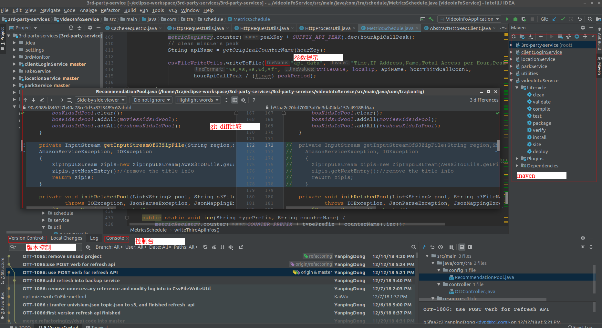
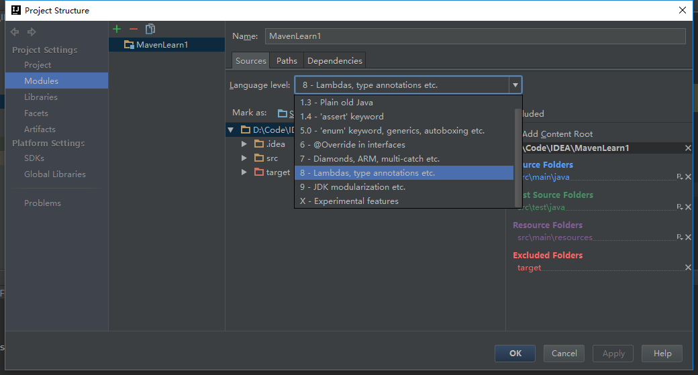
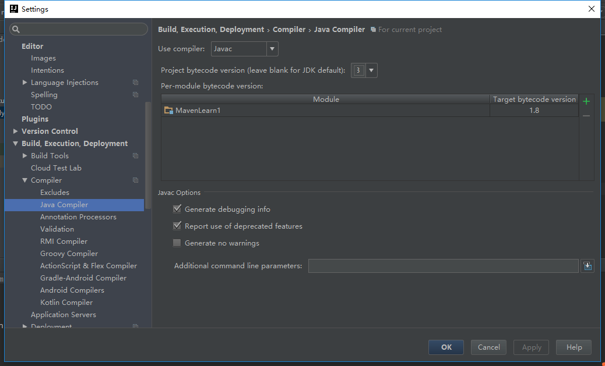

# SpringLearning

　　记录Spring框架下如何架构微服务。比如：MVC,Configuration Server,circuit breaks, intelligent routing,micro-proxy,control bus, ont-time tokens,leadership election, distributed sessions, cluster state等

　　并总结一些开发中的心得体会，比如：打log的想法是；异常处理想法;IDEA社区版使用心得等。


# Spring MVC

　　本章主要讲如何快速的使用spring boot快速搭建一个Web MVC服务。


# IDEA的方便性

　　本章主要讲在使用IDEA的时候，一些开箱即用的功能让我个人觉得眼前一亮．我没有使用商业版本，而是使用社区版本。比如：写法的一些智能提示，把更好的写法以建议的形式标出来;自带了CodeStyle检测，也可以自行加Eclipse的CodeStyle插件;调用方法时候显示表示你的参数是输给调用方法的哪一个参数;直接集成了版本控制（查看分支，比对等功能都直接开箱可用）;命令行（这样不必再开命令行做git相关操作，如果你个人喜欢通过命令行操作的话）;

　　从上可以看出IDEA把项目的所有开发周期所用到的工具都集中到了该开发环境中，所以不必来回转换；而智能提示给出的一些建议都是普适的，所以很通用。让大家写代码的时候也很容易边写边获取前人的各种经验。

下图展示了，git操作页（提交树、比较等）、终端操作页、调用参数提示、maven操作区等




# IDEA中MavenJava

在使用IntelliJ IDEA中Maven编译过程中可能会报diamond operator is not supported in -source 1.5之类的错误，出现这样的原因是Maven插件的默认配置有问题。可以下pom.xml中加入如下配置解决

```
  <properties>
    <java.version>1.8</java.version>
    <maven.compiler.source>${java.version}</maven.compiler.source>
    <maven.compiler.target>${java.version}</maven.compiler.target>
  </properties>
```

然后按"Ctrl+Shift+Alt+S"打开项目配置，设置Modules的Language Level为"8"：



最后按"Ctrl+Alt+S"打开设置，搜索"Java Compiler"，将默认jdk和当前modual的jdk版本切换为1.8即可：


