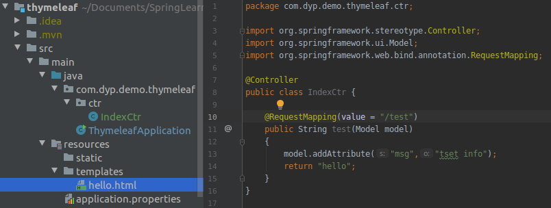
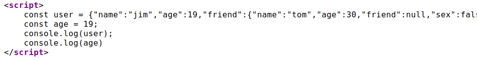

# 初始项目

最快的方案是使用`https://start.spring.io`网站，然后按要求填写一些基本说明，并在search for dependencies中输入Web关键字,如下图所示


# RequestMapping初探

## 如果不设置method

如果不设置method参数，只要路径匹配，可以接收所有方法（GET PUT POST DELETE）的请求

如果设置了method则只接收指定类型的请求

没设定method，源代码见如下：

```java
@RequestMapping(value = "{name}")
public String sayHi1(@PathVariable(name = "name")
                            String name)
{
    return "hi " + name  ;
}
```

没设定method，通过curl测试结果如下：

```sh
$ curl -X GET localhost:8080/mvc/jim
hi jim
$ curl -X PUT localhost:8080/mvc/jim
hi jim
$ curl -X DELTE localhost:8080/mvc/jim
hi jim
$ curl -X POST localhost:8080/mvc/jim
hi jim
$ curl -X OPTION localhost:8080/mvc/hi?name=jim
hi jim
```

设定method源码如下：

```java
@RequestMapping(value = "get/{name}", method = RequestMethod.GET)
    public String sayHi3(@PathVariable(name = "name")
                                 String name)
    {
        return "hi " + name  ;
    }@RequestMapping(value = "get/{name}", method = RequestMethod.GET)
    public String sayHi3(@PathVariable(name = "name")
                                 String name)
    {
        return "hi " + name  ;
    }
```

设定method后如果请求方法不匹配会报错

```sh
$ curl -X GET localhost:8080/mvc/get/jim
hi jim
$ curl -X POST localhost:8080/mvc/get/jim
{"timestamp":"2020-02-05T13:47:56.280+0000","status":405,"error":"Method Not Allowed","message":"Request method 'POST' not supported","path":"/mvc/get/jim"}
```

## GET,DELETE,PUT,POST获取数据的方法

可以通过路径参数、请求参数、请求体、cookie、请求头中得到前端传来的数据。可以使用Spring框架提供的注解，也可以直接从HttpServletRequest中读入，当然也可以通过HttpServletResponse干预Spring框架写返回信息。

示例代码如下：

```java
@RequestMapping(value = "people/info/{id}", method = RequestMethod.PUT)
    public People sayHi7(@PathVariable(name="id") int id,
                         @RequestParam int num,
                         @RequestBody People people,
                         @RequestHeader(name = "headInfo") String headInfo,
                         @CookieValue("username") String username,
                         HttpServletRequest request,
                         HttpServletResponse response)
    {
        System.out.println("cookie value: " + username);
        people.setId(id);
        people.setNum(num);
        return people ;
    }
```

可以通过curl请求，并结合断点查看数据获取情况：

```sh
curl -X PUT --cookie 'username=dyp' --header 'headInfo: test' --header 'Content-Type: application/json' --header 'Accept: application/json' -d '{"name":"tom","sex":"female","age":18}' localhost:8080/mvc/people/info/1?num=2
```

SpringMVC通过“路径”+“请求方式”来定位Controller层的响应方法。所以下面的写法是合法的，多个同名路径。

```java
@RequestMapping(value = "people/info/{id}", method = RequestMethod.POST)
    public People sayHi4(@PathVariable(name="id") int id,
                         @RequestParam int num,
                         @RequestBody People people)
    {
        people.setId(id);
        people.setNum(num);
        return people ;
    }

    @RequestMapping(value = "people/info/{id}", method = RequestMethod.GET)
    public People sayHi5(@PathVariable(name="id") int id,
                         @RequestParam int num,
                         @RequestBody People people)
    {
        people.setId(id);
        people.setNum(num);
        return people ;
    }

    @RequestMapping(value = "people/info/{id}", method = RequestMethod.DELETE)
    public People sayHi6(@PathVariable(name="id") int id,
                         @RequestParam int num,
                         @RequestBody People people)
    {
        people.setId(id);
        people.setNum(num);
        return people ;
    }
```

对与获取RequestBody来说，如果没有给出Content-Type的话GET、DELETE会直接报400错，并不像POST和PUT有默认的解析格式（如果不指定POST，PUT默认application/x-www-form-urlencoded;charset=UTF-8）。

测试错误示例如下：
```sh
$ curl -X GET -d '{"name":"tom","sex":"female","age":18}' localhost:8080/mvc/people/info/1?num=2
{"timestamp":"2020-02-06T07:20:56.388+0000","status":400,"error":"Bad Request","message":"Required request body is missing: public com.dyp.demo.model.People com.dyp.demo.ctr.RestfulApi.sayHi5(int,int,com.dyp.demo.model.People)","path":"/mvc/people/info/1"}

$ curl -X DELETE -d '{"name":"tom","sex":"female","age":18}' localhost:8080/mvc/people/info/1?num=2
{"timestamp":"2020-02-06T07:23:26.961+0000","status":400,"error":"Bad Request","message":"Required request body is missing: public com.dyp.demo.model.People com.dyp.demo.ctr.RestfulApi.sayHi6(int,int,com.dyp.demo.model.People)","path":"/mvc/people/info/1"}

$ curl -X POST -d '{"name":"tom","sex":"fe localhost:8080/mvc/people/info/1?num=2
{"timestamp":"2020-02-06T07:21:30.348+0000","status":415,"error":"Unsupported Media Type","message":"Content type 'application/x-www-form-urlencoded;charset=UTF-8' not supported","path":"/mvc/people/info/1"}


$ curl -X PUT  -d '{"name":"tom","sex":"female","age":18}' localhost:8080/mvc/people/info/1?num=2
{"timestamp":"2020-02-06T07:27:47.482+0000","status":415,"error":"Unsupported Media Type","message":"Content type 'application/x-www-form-urlencoded;charset=UTF-8' not supported","path":"/mvc/people/info/1"}
```

[本文示例代码](source/RequestMappingDemo)

# Thymeleaf

Thymeleaf是一个流行的模板引擎，该模板引擎采用Java语言开发，模板引擎是一个技术名词，是跨领域跨平台的概念，在Java语言体系下有模板引擎，在C#、PHP、python等语言体系下也有模板引擎。模板引擎能方便开发者动态的把数据渲染到页面中。

Thymeleaf与SpringMVC的视图技术，及SpringBoot的自动化配置集成非常完美，几乎没有任何成本，你只用关注Thymeleaf的语法即可。

特点：

- 它可以让美工在浏览器查看页面的静态效果，也可以让程序员在服务器查看带数据的动态页面效果。这是由于它支持 html 原型，然后在 html 标签里增加额外的属性来达到模板+数据的展示方式。浏览器解释 html 时会忽略未定义的标签属性，所以 thymeleaf 的模板可以静态地运行，即可以直接用浏览器打开页面显示，看效果，只是没数据而已。当和Spring整合后，thymeleaf模板引擎会依据数据动态的替换thymeleaf标注部分，比如替换数据、循环操作等。

- 与SpringBoot完美整合，SpringBoot提供了Thymeleaf的默认配置，并且为Thymeleaf设置了视图解析器，我们可以像以前操作jsp一样来操作Thymeleaf。代码几乎没有任何区别，就是在模板语法上有区别。

## SpringBoot与Thymeleaf整合

如果是Maven项目，引入如下依赖就可以了。只需要按要求把HTML页面放到指定位置即可，比如默认的templates目录下。

```
<dependency>
    <groupId>org.springframework.boot</groupId>
    <artifactId>spring-boot-starter-thymeleaf</artifactId>
</dependency>
```

引入后，在`org.springframework.boot.autoconfigure.thymeleaf.ThymeleafProperties`中可以看到默认了模板存放位置、模板后缀。

```java
public class ThymeleafProperties {
    private static final Charset DEFAULT_ENCODING;
    public static final String DEFAULT_PREFIX = "classpath:/templates/";
    public static final String DEFAULT_SUFFIX = ".html";
    private boolean checkTemplate = true;
    private boolean checkTemplateLocation = true;
    private String prefix = "classpath:/templates/";
    private String suffix = ".html";
    private String mode = "HTML";
```

示例代码的目录结构如下图所示，使用的是默认路径



## Thymeleaf常用语法

Thymeleaf的主要作用是把`org.springframework.ui.Model`中的数据渲染到html中，因此其语法主要是如何解析model中的数据。从以下方面来学习：

- 变量、方法、条件判断、循环、运算 [逻辑运算、布尔运算、比较运算、条件运算]
- 其他

## 变量

Thymeleaf通过${}来获取model中的变量，注意这不是el表达式，而是ognl表达式，但是语法非常像。

```java
public class User {
    String name;
    int age;
    User friend;
}

//下面添加到controller中
@GetMapping("test2")
    public String test2(Model model){
        User user = new User();
        user.setAge(18);
        user.setName("jim");
        user.setFriend(new User("tom", 30));
        model.addAttribute("user", user);
        return "/sys/user";
    }
```

心细的朋友应该注意到我的返回路径不再是单一的，而是有目录层次的了`/sys/user`。只要放在默认templates目录下即可。

我们看下HTML中使用方式是经典的`对象.属性名`方式。当然也可是`对象['名称']`的方式，但要包在`${}`中

```html
<h1>
    你好：<span th:text="${user.name}">请跟我来</span>
</h1>
```

Thymeleaf崇尚模板是纯正的html代码，脱离模板引擎，在纯静态环境也可以直接运行。现在如果我们直接在html中编写 ${}这样的表达式，显然在静态环境下就会出错，这不符合Thymeleaf的理念。

Thymeleaf中所有的表达式都需要写在"指令"中，指令是HTML5中的自定义属性，在Thymeleaf中所有指令都是以th:开头。因为表达式${user.name}是写在自定义属性中，因此在静态环境下，表达式的内容会被当做是普通字符串，浏览器会自动忽略这些指令，这样就不会报错了。

如果我们不经过SpringMVC，而是直接用浏览器打开编写的页面：在静态环境下,th指令不会被识别，但是也不会报错，而是显示\<span\>标签的缺省默认值："请跟我来"

指令的设计，正是Thymeleaf的高明之处，也是它优于其它模板引擎的原因。动静结合的设计，使得无论是前端开发人员还是后端开发人员可以完美契合。

如果每个数据调用都要加`user.`会很麻烦，所以可以借用在HTML结构中，父结构里添加t`h:object="${user}"`获取user的值，并且保存。子元素在使用的时候通过`*{属性名}`的方式，来获取在父元素中保存的对象属性，如下示例：

```html
<h2 th:object="${user}">
    <p>Name: <span th:text="*{name}">Jack</span>.</p>
    <p>Age: <span th:text="*{age}">21</span>.</p>
    <p>friend: <span th:text="*{friend.name}">Rose</span>.</p>
</h2>
```

## Thymeleaf内置对象

这些内置对象中提供了一些方法，方便我们来调用。获取这些内置对象，需要使用`#对象名`来引用。

- 环境相关对象

对象 | 作用 
-|-
#ctx | 获取Thymeleaf自己的Context对象
#requset | 如果是web程序，可以获取HttpServletRequest对象
#response |	如果是web程序，可以获取HttpServletReponse对象
#session |	如果是web程序，可以获取HttpSession对象
#servletContext |	如果是web程序，可以获取HttpServletContext对象

- Thymeleaf提供的全局对象

对象 | 作用 
-|-
#dates | 处理java.util.date的工具对象
#calendars | 处理java.util.calendar的工具对象
#numbers | 用来对数字格式化的方法
#strings | 用来处理字符串的方法
#bools | 用来判断布尔值的方法
#arrays | 用来护理数组的方法
#lists | 用来处理List集合的方法
#sets | 用来处理set集合的方法
#maps | 用来处理map集合的方法

## 字面值

在指令中填写基本类型如：字符串、数值、布尔等，并不希望被Thymeleaf解析为变量，这个时候称为字面值。

**字符串字面值**

使用一对'引用的内容就是字符串字面值了：

```html
<p>
  你正在观看 <span th:text="'thymeleaf'">template</span> 的字符串常量值.
</p>
```

th:text中的thymeleaf并不会被认为是变量，而是一个字符串

**数字字面值**

数字不需要任何特殊语法， 写的什么就是什么，而且可以直接进行算术运算

```html
<p>今年是 <span th:text="2018">1900</span>.</p>
<p>两年后将会是 <span th:text="2018 + 2">1902</span>.</p>
```

**布尔字面值**

布尔类型的字面值是true或false：

```html
<div th:if="true">
    你填的是true
</div>
```
这里引用了一个th:if指令

## 拼接

普通字符串与表达式拼接的情况：

```html
<span th:text="'欢迎您:' + ${user.name} + '!'"></span>
```

字符串字面值需要用''，拼接起来非常麻烦，Thymeleaf对此进行了简化，使用一对|即可：

```html
<span th:text="|欢迎您:${user.name}|"></span>
```

## 运算

需要注意：${}内部的是通过OGNL表达式引擎解析的，外部的才是通过Thymeleaf的引擎解析，因此运算符尽量放在${}外进行。

**算术运算**

支持的算术运算符：+ - * / %

```html
<span th:text="${user.age}"></span>         //21
<span th:text="${user.age}%2 == 0"></span>  //false
```

**比较运算**

支持的比较运算：>, <, >= and <= ，但是>, <不能直接使用，因为xml会解析为标签，要使用别名。

注意 == and !=不仅可以比较数值，类似于equals的功能。

可以使用的别名：gt (>), lt (<), ge (>=), le (<=), not (!). Also eq (==), neq/ne (!=).

**条件运算**

```html
三元运算

<span th:text="${user.sex} ? '男':'女'"></span>

默认值

有的时候，我们取一个值可能为空，这个时候需要做非空判断，可以使用 表达式 ?: 默认值简写：

<span th:text="${user.name} ?: '二狗'"></span>

当前面的表达式值为null时，就会使用后面的默认值。

注意：?:之间没有空格。
```

## 循环

使用th:each指令来完成

```html
集合：users在Context中。

<tr th:each="user : ${users}">
    <td th:text="${user.name}">Onions</td>
    <td th:text="${user.age}">2.41</td>
</tr>

```

${users} 是要遍历的集合，可以是以下类型：

    Iterable，实现了Iterable接口的类
    Enumeration，枚举
    Interator，迭代器
    Map，遍历得到的是Map.Entry
    Array，数组及其它一切符合数组结果的对象

在迭代的同时，我们也可以获取迭代的状态对象：

```html
<tr th:each="user,stat : ${users}">
    <td th:text="${user.name}">Onions</td>
    <td th:text="${user.age}">2.41</td>
    <td th:text="${stat.index}">2.41</td>
</tr>
```

stat对象包含以下属性：

    index，从0开始的角标
    count，元素的个数，从1开始
    size，总元素个数
    current，当前遍历到的元素
    even/odd，返回是否为奇偶，boolean值
    first/last，返回是否为第一或最后，boolean值

遍历也可以嵌套

```html
<li  th:each="submenues: ${menues}" >
    <ul>
        <li th:each="submenue: ${submenues.value}"><a href="javascript:void(0)" class="myLeftMenu" th:href="@{${submenue.url}}" th:text="${submenue.name}"></a></li>
    </ul>
</li>
```

## 逻辑判断

Thymeleaf中使用th:if 或者 th:unless ，两者的意思恰好相反。

```html
<span th:if="${user.age} < 24">fresh man</span>
```

如果表达式的值为true，则标签会渲染到页面，否则不进行渲染。

以下情况被认定为true：

    表达式值为true
    表达式值为非0数值
    表达式值为非0字符
    表达式值为字符串，但不是"false","no","off"
    表达式不是布尔、字符串、数字、字符中的任何一种

其它情况包括null都被认定为false

## 分支控制switch

这里要使用两个指令：th:switch 和 th:case

```html
<div th:switch="${user.role}">
  <p th:case="'admin'">用户是管理员</p>
  <p th:case="'manager'">用户是经理</p>
  <p th:case="*">用户是别的玩意</p>
</div>
```

需要注意的是，一旦有一个th:case成立，其它的则不再判断。与java中的switch是一样的。

另外th:case="*"表示默认，放最后。

## JS模板

模板引擎不仅可以渲染html，也可以对JS中的进行预处理。而且为了在纯静态环境下可以运行，其Thymeleaf代码可以被注释起来：

```html
<script th:inline="javascript">
    const user = /*[[${user}]]*/ {};
    const age = /*[[${user.age}]]*/ 20;
    console.log(user);
    console.log(age)
</script>
```

在script标签中通过th:inline="javascript"来声明这是要特殊处理的js脚本

语法结构：

const user = /*[[Thymeleaf表达式]]*/ "静态环境下的默认值";

因为Thymeleaf被注释起来，因此即便是静态环境下， js代码也不会报错，而是采用表达式后面跟着的默认值。且User对象会被直接处理为json格式。

示例代码的被模板引擎渲染后如下：


