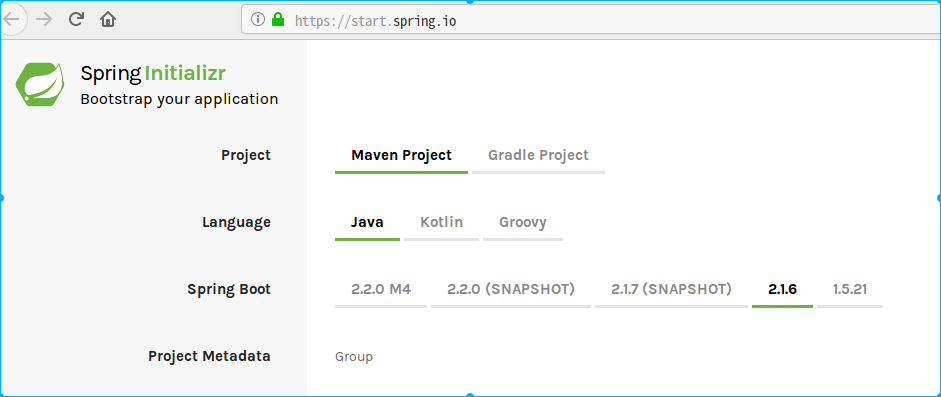

# Spring MVC

本章主要讲如何快速的使用spring boot快速搭建一个Web MVC服务。

最快的方案是使用https://start.spring.io网站，然后按要求填写一些基本说明，并在search for dependencies中输入Web关键字,如下图所示



## RequestMapping初探

### 如果不设置method

如果不设置method参数，只要路径匹配，可以接收所有方法（GET PUT POST DELETE）的请求

如果设置了method则只接收指定类型的请求

没设定method，源代码见如下：

```java
@RequestMapping(value = "{name}")
public String sayHi1(@PathVariable(name = "name")
                            String name)
{
    return "hi " + name  ;
}
```

没设定method，通过curl测试结果如下：

```sh
$ curl -X GET localhost:8080/mvc/jim
hi jim
$ curl -X PUT localhost:8080/mvc/jim
hi jim
$ curl -X DELTE localhost:8080/mvc/jim
hi jim
$ curl -X POST localhost:8080/mvc/jim
hi jim
$ curl -X OPTION localhost:8080/mvc/hi?name=jim
hi jim
```

设定method源码如下：

```java
@RequestMapping(value = "get/{name}", method = RequestMethod.GET)
    public String sayHi3(@PathVariable(name = "name")
                                 String name)
    {
        return "hi " + name  ;
    }@RequestMapping(value = "get/{name}", method = RequestMethod.GET)
    public String sayHi3(@PathVariable(name = "name")
                                 String name)
    {
        return "hi " + name  ;
    }
```

设定method后如果请求方法不匹配会报错

```sh
$ curl -X GET localhost:8080/mvc/get/jim
hi jim
$ curl -X POST localhost:8080/mvc/get/jim
{"timestamp":"2020-02-05T13:47:56.280+0000","status":405,"error":"Method Not Allowed","message":"Request method 'POST' not supported","path":"/mvc/get/jim"}
```