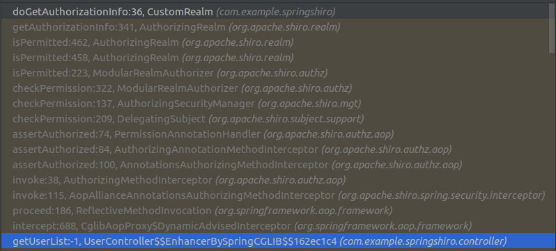
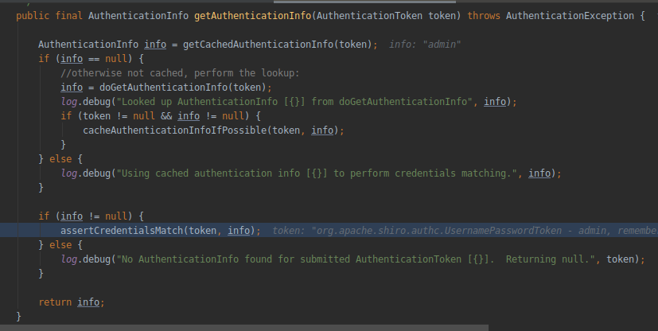
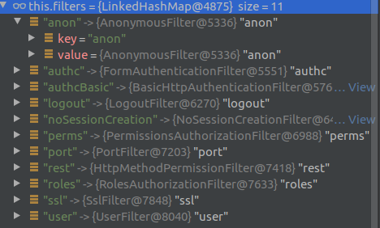

# session如何传递

首先，session机制是一种服务器端的机制，服务器使用一种类似于散列表的结构（也可能就是使用散列表）来保存信息。以下可以理解成使用网页和后台的交互过程，当然也可以衍生到APP。只要和后台协商好传递方式即可，也可以延用下面的方式。

当浏览器请求一个需要session的服务页面时，服务器首先检查这个客户端的请求里是否已包含了一个session标识（session id），如果已包含则说明以前已经为此客户端创建过session，服务器就按照session id把这个session检索出来使用（检索不到，会新建一个）。如果客户端请求不包含session id，则为此客户端创建一个session并且生成一个与此session相关联的session id，session id的值应该是一个既不会重复，又不容易被找到规律以仿造的字符串，这个session id将被在本次响应中返回给客户端保存。交给浏览器的方式有以下三种。

1. 采用cookie中写入session id，这样在交互过程中浏览器可以自动的按照规则取出session id,并在下次请求的时候把这个标识发送给服务器。一般这个cookie的名字都是类似于SEEESIONID比如：本文的JSESSIONID(Jsessionid只是tomcat的对sessionid的叫法)。

2. 但cookie可以被人为的禁止，则必须有其他机制以便在cookie被禁止时仍然能让客户端取得session id。经常被使用的一种技术叫做URL重写，就是把session id直接附加在URL路径的后面。附加方式有两种:一种是作为URL路径的附加信息，表现形式为`http://host/path;jsessionid=xxx`
另一种是作为查询字符串附加在URL后面，表现形式为:`http://host/path?jsessionid=xxx`

```
JSP中使用`response.encodeURL（"你要跳转的页面"）`来重写页面里要跳转的默认URL
```

3. 还有一种技术叫做表单隐藏字段。就是服务器会自动修改表单，添加一个隐藏字段，以便在表单提交时能够把session id传递回服务器。

```html
<form name="testform" action="/xxx">
    <input type="hidden" name="jsessionid" value="ByOK3vjFD75aPnrF7C2HmdnV6QZcEbzWoWiBYEnLerjQ99zWpBng!-145788764">
    <input type="text">
</form>
```

4. 也可以附加在返回的响应字段里，比如在成功后返回的数据结构中添加一个session id字段：{"sessionId":"xxxxxx","otherInfo":""}
       
## Shiro如何验证用户和用户权限

前端（比如页面）如果有session id，则将session id连同信息一起发往后端，如果没有则只发送信息到请求路径即可。

后端收到后会检测session id是否有对应的Session，如果有则看是否登录完成，如果完成登录检查所要访问的路径是否有访问权限。

如果没有Session或者SessionId没有找到Session信息，则跳转到登录验证类，默认会到表单认证filter。如果没有通过，则要求跳转到设定的login界面。

如果在通过表单页面验证会给出302跳转请求，指定跳转页面，浏览器会发第二次请求，这次就有session id，并能通过权限判断并请求到跳转接口。

也就是说，在登录认证完成后，只要session id没有失效，带着SessionID去后台就可一访问有授权的接口，后台依据该session id来判断是否有权限

# shiro身份认证、鉴权流程

当Web请求进来后会通过SpringShiroFilter做过滤。这个过滤器最主要的作用就是身份认证。而鉴权是由AOP完成的，后面会提到。

SpringShiroFilter大体流程如下：

1. 创建Subject
- 1.1  尝试通过Web Request获取Session，如果没有则拿到的是null，如果有则保存到Shiro context上下文对象中
- 1.2  尝试获取princeipal(登录用户名)。如果以前登录成功会在Session中存在org.apache.shiro.subject.support.DefaultSubjectContext_PRINCIPALS_SESSION_KEY的key下
- 1.3  设置authenticated值，如果登录成功该值会以AUTHENTICATED_SESSION_KEY为key保存在Session中，为以后调用isAccessAllowed方法调用做标志位（2.4.2步骤）

2. 通过Subject.execute执行filter chain
- 2.0 将subject绑定到LocalThread中。供后面使用。
- 2.1 获取请求路径URI，比如：“index”
- 2.2 依据请求路径URI匹配获取可处理的shiroFilter。如下图所示，是依据Shiro配置生成的。

- 2.3 使用2.2获取的Filter创建ProxidFilterChain对象
- 2.4 使用ProxidFilterChain对象过滤请求（开始身份验证之旅），该过程主要有两个。

```
2.4.1 判断Filter是否适合处理该请求
2.4.2 判断过滤链是继续还是终止。主要用的是两个方法。isAccessAllowd和onAccessDenied

isAccessAllowd中有两个过程：
a) 通过当前线程的subject（1.4生成的）查看authenticated值
b) 通过!isLoginRequest判断是否登录请求
```

源码如下：
```java
 protected boolean isAccessAllowed(ServletRequest request, ServletResponse response, Object mappedValue) {
        return super.isAccessAllowed(request, response, mappedValue) ||
                (!isLoginRequest(request, response) && isPermissive(mappedValue));
    }
```

```
onAccessDenied的过程如下：
判断是否是login请求？
   Y：是否是login POST请求？
      Y： 尝试获取username,password做身份验证。Login失败的话报错但不会终止对实际Controller方法的访问，因为考虑到可能用户在框架外实现登录方法。本文的实例就属于自己实现。如果成功则用已有的Subject对象作为Context再创建一个新的Subject。并把principal和authenticated放入Session中，即1.2 1.3步需要的。（如果自己实现登录，也是成功后保存数据到Session中）
      N:  直接通过身份验证，进入实际请求过滤阶段最终到达login接口（比如GET login返回login界面）
  N: 执行saveRequestAndRedirectToLogin。其流程如下
  a) 获取当前线程的subject
  b) 通过subject取得Session，如果不存在则创建Session。（创建完成后在以sessionId为key存入ManagerBase的sessions的Map中），并写入cookie，等着返回给用户
  c) 写入redirect url到Response。会使用encodeRedirectURL把jsessionid添加到ligin uri的尾部
```

源码如下：
```java
protected boolean onAccessDenied(ServletRequest request, ServletResponse response) throws Exception {
        if (isLoginRequest(request, response)) {
            if (isLoginSubmission(request, response)) {
                if (log.isTraceEnabled()) {
                    log.trace("Login submission detected.  Attempting to execute login.");
                }
                return executeLogin(request, response);
            } else {
                if (log.isTraceEnabled()) {
                    log.trace("Login page view.");
                }
                //allow them to see the login page ;)
                return true;
            }
        } else {
            if (log.isTraceEnabled()) {
                log.trace("Attempting to access a path which requires authentication.  Forwarding to the " +
                        "Authentication url [" + getLoginUrl() + "]");
            }

            saveRequestAndRedirectToLogin(request, response);
            return false;
        }
    }
```

3. 请求结束

## 身份认证完成后其他请求如何再认定身份

即上一节中1--2.4.2的过程一样，只是在isAccessAllowed的时候会返回为true。即过滤继续，那么这个时候的登录验证结束。开始正常的web filter最后调用实际请求方法。最后转入Shiro权限认证过程。而权限认证过程实际是通过AOP来完成。通过下图可以看出，Shiro加强了实际请求方法的功能，在做实际动作前先判断是否有权限。



## 身份认证方法是？

可以看图我们自己写的realm的doGetAuthenticationInfo，其实只是给出了数据信息。认证是在 assertCredentialsMatch里做的。如下图所示。




## 默认的Shiro Filter有那些？

