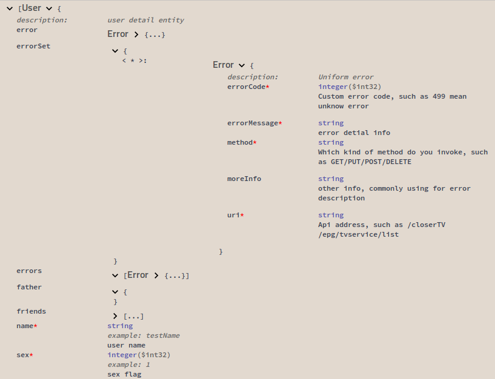

# Swagger

Swagger是一个规范和完整的框架，用于生成、描述、调用和可视化Restful风格的Web服务。总体目标是使客户端和文件系统作为服务器以同样的速度来更新文件的方法，*参数和模型紧密集成到服务器端的代码，允许API来始终保持同步。*

把说明文档通过注解绑定到接口上，做到同步。这样必然造成‘辅助’性注解在接口和模型中变多。好在注解并不实际干预与侵入业务代码。就像是写注释一样。

## Swagger集成

spingboot集成Swagger2很简单，只需要映入两个依赖。添加一个配置类即可

```
<!-- https://mvnrepository.com/artifact/io.springfox/springfox-swagger2 -->
<dependency>
    <groupId>io.springfox</groupId>
    <artifactId>springfox-swagger2</artifactId>
    <version>2.9.2</version>
</dependency>
<dependency>
    <groupId>io.springfox</groupId>
    <artifactId>springfox-swagger-ui</artifactId>
    <version>2.9.2</version>
</dependency>
```

配置文件写法，必须在SpringBoot的Scan范围内。最简单的就是把配置文件夹放在`@SpringBootApplication`标注的类所在的文件夹的子文件夹中。
```java
package com.dyp.demo.swagger.config;

import org.springframework.beans.factory.annotation.Value;
import org.springframework.context.annotation.Bean;
import org.springframework.context.annotation.Configuration;
import springfox.documentation.builders.ApiInfoBuilder;
import springfox.documentation.builders.PathSelectors;
import springfox.documentation.builders.RequestHandlerSelectors;
import springfox.documentation.service.ApiInfo;
import springfox.documentation.service.Contact;
import springfox.documentation.spi.DocumentationType;
import springfox.documentation.spring.web.plugins.Docket;
import springfox.documentation.swagger2.annotations.EnableSwagger2;

@Configuration
@EnableSwagger2
public class Swagger2Config {
    //是否开启swagger，正式环境一般是需要关闭的
    @Value("${swagger.enabled}")
    private boolean enableSwagger;

    @Value("${swagger.version}")
    private String version;

    @Bean
    public Docket createRestApiDoc() {
        return new Docket(DocumentationType.SWAGGER_2)
                .apiInfo(apiInfo())
                .enable(enableSwagger)
                .select()
                //指定路径处理PathSelectors.any()代表所有的路径
                .paths(PathSelectors.any())
                .build();
    }

    private ApiInfo apiInfo() {
        return new ApiInfoBuilder()
                .title("Spring boot use swagger2 create API doc")
                .description("API doc")
                .termsOfServiceUrl("http://127.0.0.1:8080")
                .contact( new Contact("lear", "your url", "lear521@163.com"))
                .version(version)
                .build();
    }
}

```

## swagger表示存在的问题

以下测试是基于swagger 2.9.2做的测试

1. 避免使用Map类型数据，在Sawgger-Ui展示的时候Map中的Key类型会丢失，能看到的是`<*>`。参看下面示例errorSet的Key显示

2. 不要自引用，识别不到，在Swagger-ui里会是`{}`。参看下面示例father显示

如果有不可避免的原因使用上面方式表达模型，给出example是一个很好的解决方案

以上两个问题可以参考下面模型中User对象里的自引用和Error对象引用在Swagger-ui里的区别。还有可以看到Map识别也是有问题

```java
@ApiModel(description = "user detail entity", value = "User")
public class User {
    @ApiModelProperty(required = true, value = "user name", example = "testName")
    private String name;

    @ApiModelProperty(required = true, value = "sex flag", example = "1")
    private int sex;

    @ApiModelProperty(required = false)
    private User father;

    @ApiModelProperty(required = false, notes="java.util.List<user>", dataType = "java.util.List<user>", example = "[{\"name\":\"sampleName\",\"sex\":1}]")
    private List<User> friends;

    @ApiModelProperty(required = false)
    private Error error;

    @ApiModelProperty(required = false)
    private List<Error> errors;

    @ApiModelProperty(required = false )
    private Map<Integer, Error> errorSet;

    @ApiModelProperty(required = false, notes="java.util.Map<String, Integer>", dataType = "java.util.Map<String, Integer>",example = "{\"name\":1,\"sex\":1}")
    private Map<String,Integer>  tree;
}
```
Swagger-ui展示




## SpringBoot ctr层常使用的Swagger 注解

SpringBoot下一般只需要使用，`@Api @ApiOperation @ ApiResponses @ApiResponse @ApiParam`就足够了

如果在使用Servlets活器他non-JAX-RS环境的时候，就需要`@ApiImplicitParams @ApiImplicitParam`来定义传入参数。

如下ApiImplicitParam的参数需要注意！

1. dataType="int" 代表请求参数类型为int类型，当然也可以是Map、User、String等；如果填写了dataTypeClass 会覆盖该参数。

2. paramType="body" 代表参数应该放在请求的什么地方：

    header-->放在请求头。请求参数的获取：@RequestHeader(代码中接收注解)

    query-->用于get请求的参数拼接。请求参数的获取：@RequestParam(代码中接收注解)
    
    path（用于restful接口）-->请求参数的获取：@PathVariable(代码中接收注解)
    
    body-->放在请求体。请求参数的获取：@RequestBody(代码中接收注解)
    
    form（不常用）

## Springboot Model常用注解

`@ApiModel @ApiModelProperty` 就够了

[实例代码](source/swagger)